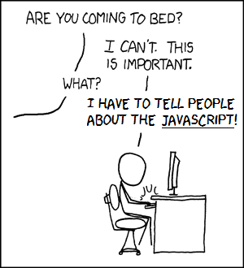

## Why does coding style matter?

Upon taking on the journey that I Computer Science here at UH Manoa, one thing that was prevalent in every single ICS class that dealt with programming was Coding Style.  Before ICS 314 class, I always saw coding style as an effort from the Professor teaching the class to minus points from our programming projects.  About a month into ICS 314 the value that coding standards have hit me like a bus.  Back in ICS 212, we were given the usual talk about the class coding style, and how we had to follow it, and disregarding them would result in points taken off our grades.  One thing I was shown was examples of Coding Style's that different companies use, some being Google and Microsoft.  In ICS 314 it was made known that communication was key in Software Engineering.  After a bit of pondering, I was able to realize that Coding Style itself was another langauge that people within the same work enviorment, whether that be a big company or a college class, use to help communicate to each other.  In a specific work enviorment, having code that looks, flows, and works the same way as other code within that work enviorment can make it tremendously easier to communicate with others, and make it as easy as possible for others to understand what is trying to be accomplished, so they can work with or help debug said code.  Having a specific coding style also can change the way that code works.  For example, in my ICS 212 class which dealt with C and C++, it was taboo to use multiple return statements within a function, and it was part of the class coding style to have a single return statement.  In ICS 211, which delth with Java, it was perfectly ok to have multiple return statements, which often made writing functions a bit easier.  Having said that, coding style is extremely important as it not only makes it easier for code to be communicated within a work enviroment, but can also change the way code works and functions.

## Using the IntelliJ IDE and ESLint for the first time

To program, I've really only used Eclipse for Java, Unix for C and C++, and a small amount of Microsoft Visual Studio.  IntelliJ will be the third IDE I will be learning to use.  After the first week, I can say that I have become quite fond of it.  It has a more smooth feeling to it versus Eclipse, and is much more user friendly than Unix will ever be.  IDE's in my opinion are crucial to make sure that a large project and even a college level project, get properly executed.  Within Unix, most errors have to be handled by the user, and most errors must be found by the user.  They also making keeping track of large projects with multiple source files effortless.  All the files are kept in one place, and each file is easily accessible.  In Unix, since everything is pretty much manual, all file paths and coilation must be handled by the user, and that becomes another process to make sure all sources files can be compiled and linked.   During my time in ICS 212 using Unix, my brain got fried much faster looking for bugs and errors versus using Eclipse in ICS 111 and 211, and ICS 314. IDE's have the ability to correct and easily debug code, which I believe is a excellent time saver when making big projects, and less stressful on the brain, as most of the error handling is taken care of by the IDE.  ESLint, a coding quality tool, could be considered the Grammarly of coding.  I say this because using it in IntelliJ helps me conform, very easily, to the ICS 314 class coding standard.  Using Unix, I never had a tool like ESLint or the features of the IDE, so i had to check my code using a checklist to make sure my code followed the ICS 212 coding standard.  So all in all, having IDE is like having an automatic car and letting the car switch the gears, and not having one gets you a manual car, while not being difficult to learn, can be a bit tedious until you've mastered it.
